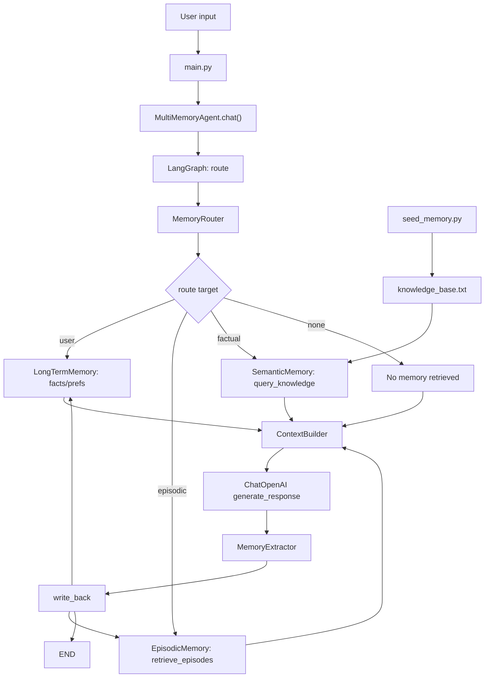

# 🧠 Multi-Memory AI Agent

Dự án triển khai một AI Agent tiên tiến với hệ thống đa tầng ký ức (Multi-Memory System), được xây dựng bằng Python, LangGraph và ChromaDB. Agent không chỉ trả lời câu hỏi mà còn có khả năng tự phản tư, học hỏi từ trải nghiệm và ghi nhớ thông tin cá nhân của người dùng.

## 🌟 Tính năng nổi bật

- **Hệ thống 4 tầng ký ức:**
  - **Short-term Memory:** Duy trì ngữ cảnh hội thoại hiện tại (Chat History).
  - **Long-term Memory:** Lưu trữ sự thật và sở thích người dùng vào Redis (có cơ chế dự phòng In-memory).
  - **Episodic Memory:** Lưu trữ các "trải nghiệm" giải quyết vấn đề dưới dạng vector để tái sử dụng trong tương lai.
  - **Semantic Memory:** Kho tri thức (RAG) giúp Agent truy xuất các kiến thức thực tế được nạp vào.
- **Memory Router:** LLM tự động điều hướng truy vấn đến ngăn nhớ phù hợp nhất.
- **Self-Reflection:** Agent tự đánh giá và phản tư sau mỗi lần tương tác để cải thiện câu trả lời.
- **Robustness:** Cơ chế dự phòng thông minh khi thiếu hụt hạ tầng (ví dụ: tự chuyển sang RAM nếu không có Redis).

## 🏗️ Kiến trúc hệ thống



```text
memory_Agent/
├── memory/          # Các module quản lý 4 loại ký ức
├── core/            # Luồng xử lý chính (Agent, Router, Context)
├── utils/           # Công cụ trích xuất thông tin và xử lý Token
├── benchmark/       # Hệ thống đánh giá và báo cáo hiệu năng
├── data/            # Cơ sở dữ liệu Vector (ChromaDB)
└── main.py          # Điểm chạy ứng dụng demo
```

## 🚀 Hướng dẫn cài đặt

1. **Clone dự án:**
   ```bash
   git clone https://github.com/thagn123/Lab17_track3_DaoQuangThang_2A202600030.git
   cd memory_Agent
   ```

2. **Cài đặt thư viện:**
   ```bash
   pip install -r requirements.txt
   ```

3. **Cấu hình môi trường:**
   Tạo file `.env` tại thư mục gốc và thêm API Key của bạn:
   ```text
   OPENAI_API_KEY=your_openai_api_key_here
   ```

## 📊 Chạy Thử nghiệm & Đánh giá

Hệ thống đi kèm với bộ Benchmark mạnh mẽ để so sánh Agent có bộ nhớ và LLM thông thường:

```bash
# Nạp dữ liệu tri thức ban đầu
python seed_memory.py

# Chạy đánh giá hiệu năng
python benchmark/evaluator.py
```

Sau khi chạy, bạn có thể xem báo cáo chi tiết tại:
- `benchmark/benchmark_report.md`: So sánh kết quả.
- `benchmark/memory_debug_report.md`: Chi tiết trạng thái các ngăn nhớ.

## 🛠️ Công nghệ sử dụng

- **Ngôn ngữ:** Python 3.10+
- **Framework:** LangGraph, LangChain
- **LLM:** OpenAI (GPT-4o, GPT-4o-mini)
- **Vector DB:** ChromaDB (OpenAI Embeddings)
- **NoSQL:** Redis (Long-term storage)
